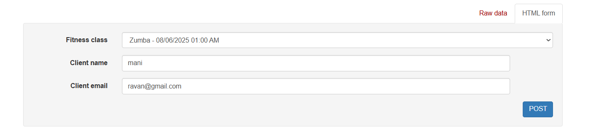
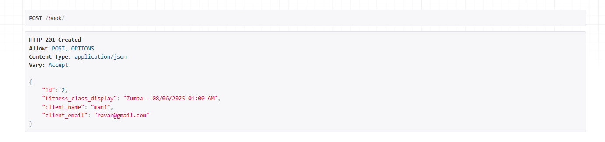

# 🏋️‍♀️ Fitness Studio Booking API

A simple REST API for booking fitness classes like Yoga, Zumba, and HIIT at a fictional fitness studio. Built with **Python** and **Django** to demonstrate backend development skills, including API design, input validation, error handling, and timezone management.

---

## 🚀 Features

- 📅 View all upcoming fitness classes  
- 📝 Book a class by providing name, email, and class name  
- 🔎 Retrieve bookings by email  
- ✅ Handles overbooking and missing data gracefully  
- 🌐 Timezone-aware class schedules (IST by default)

---

## 🧪 Running the Project (Django)

First, ensure that a virtual environment `venv` exists. If not, create one using the steps below.

A virtual environment is used to isolate project dependencies so they don’t affect the global Python environment.

### Steps:

1. **Create the virtual environment**  
   The following command creates a `venv` folder containing all the project dependencies:
   ```
   python -m venv env
   ```

2. **Activate the virtual environment**

   On ```Windows```, use:
   ```
   venv\Scripts\activate
   ```


3. **Navigate to the project directory**

   Make sure you are in the same directory where manage.py is located.


4. **Install dependencies**

   If requirements.txt is present, install all required packages using:
    ```
    pip install -r requirements.txt
    ```
    
5. **Run database migrations**

   To apply migrations and set up the database schema:
   ```
   python manage.py makemigrations  
   python manage.py migrate
   ```

6. **👤Creating an Admin User**

   To access the Django admin panel or manage data securely, you'll need to create a superuser account.

   Run the following command:

   ```
   python manage.py createsuperuser
   ```

   we have to remember the username and password
   ```
   Username (leave blank to use 'manik'):

   Email address:
   
   Password:
   
   Password (again):
   
   This password is too short. It must contain at least 8 characters.
   
   This password is too common.
   
   This password is entirely numeric.
   
   Bypass password validation and create user anyway? [y/N]: y
   
   Superuser created successfully.
   ```

7. **Start the development server**

   Launch the Django development server with:
   ```bash
   python manage.py runserver
   
---

## 📊 Project Structure

| route                                    | Description                                                                    | method |
|------------------------------------------|--------------------------------------------------------------------------------|--------|
| **create/classes/**                      | This route is for creating fintness class.                                       | POST |
| **classes/**                             | Lists upcoming classes with name, time, instructor, and slots.                  | get |
| **book/**                                | Books a class if slots available, then reduces slot count.                     | get |
| **bookings/?email=example@gmail.com/**   | Returns all bookings made by a specific email address                           | get |


## Use

### To test the API'S

### First, start Django's development server.

```
python manage.py runserver
```

1. **create/classes/**

   This is a ```POST``` endpoint used to add new fitness classes. Before using this endpoint, you must first create a superuser. Once the superuser is created, you can add class details by sending the following JSON payload:

   ```
   This is the route to create the classes
   http://127.0.0.1:8000/create/classes/
   ```
   **payload**
   ```
   {
    "fitness_class_name": "Zumba",
    "class_datetime": "06/06/2025 06:30 AM",
    "instructor": "John Doe",
    "available_slots": 20
   }
   ```

   It will create fitness classes

2. **classes/**
   
   This is the ```get``` method what ever the classes we created we can see that classes using this route.
   ```
   this is the route for Lists upcoming classes with name, time, instructor, and slots.

   http://127.0.0.1:8000/classes/
   ```
   **Output**
   ```
   [
    {
        "id": 3,
        "name": "Zumba",
        "datetime": "08/06/2025 06:30 AM",
        "instructor": "John Doe",
        "available_slots": 20,
        "is_upcoming": true
    },
    {
        "id": 4,
        "name": "Zumba",
        "datetime": "09/06/2025 06:30 AM",
        "instructor": "John Doe",
        "available_slots": 0,
        "is_upcoming": true
    },
    {
        "id": 5,
        "name": "Zumba",
        "datetime": "09/06/2025 06:30 AM",
        "instructor": "John Doe",
        "available_slots": 0,
        "is_upcoming": true
    }
   ]
   ```

3. **book/**

   this is the ```post``` method to book the classes which are avaliable if the slots are not avaliable that class data wont show to create the user.
   ```
   this is the route for Books a class if slots available.

   http://127.0.0.1:8000/book/
   ```
   
   After creating it will show case the output like following:

   


4. **bookings/?email=example@gmail.com/**
   
   It will return the data for the particular email how many classes that user want to join
   ```
   This is the route to create the classes
   http://127.0.0.1:8000/bookings/?email=mani@gmail.com
   ```

   **Output**
   ```  
   [
       {
           "id": 1,
           "fitness_class_display": "Zumba - 09/06/2025 01:00 AM",
           "client_name": "mani",
           "client_email": "mani@gmail.com"
       }
   ]
   ```

### This are all the total api end points for the Fitness Booking API

## For running Testcases
   ```
    python manage.py test bookings
   ```

## ------------------------------------- THE END ------------------------------------------
